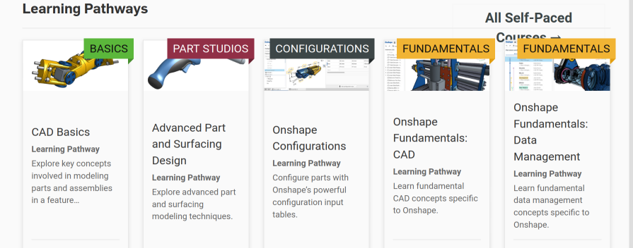
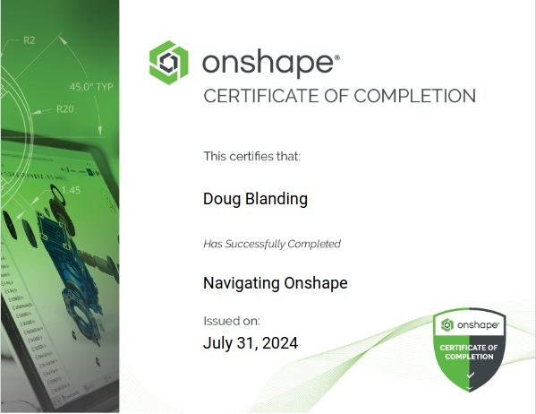
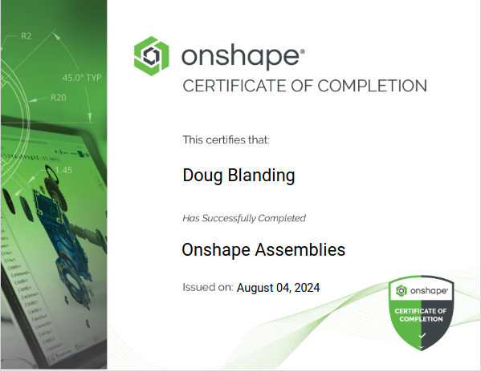
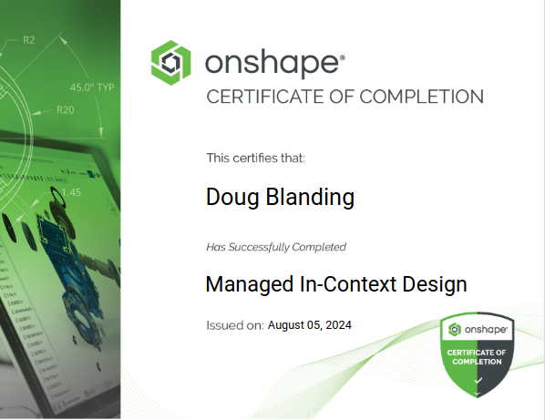
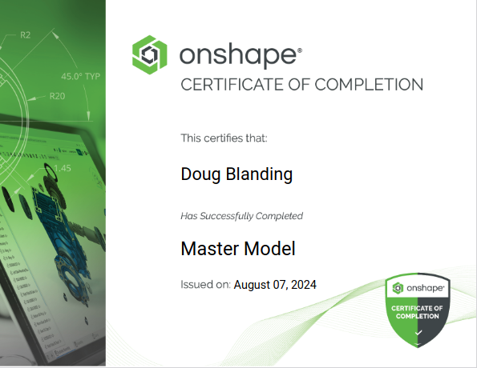
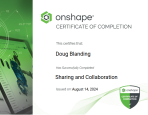
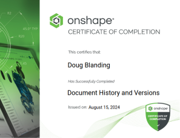
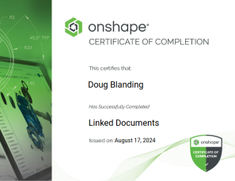
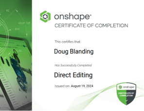

# Learning [Onshape](https://cad.onshape.com/signin)
* [Browser compatibility check](https://cad.onshape.com/check)

## Onshape Training
1. If you're a beginner at CAD, start with this series of 5 tutorials by CADSessions: [Beginner Tutorial 1/5 - Onshape 3D CAD - Creating Sketches and Objects](https://www.youtube.com/watch?v=pMWnsHpDlQE)

2. Once you have learned the basics, I recommend Onshape's self-paced online tutorials (with Exercises) at [Onshape Learning Pathways](https://learn.onshape.com/)

* And they provide a [Dashboard](https://learn.onshape.com/learn/dashboard) 
to keep track of your completed training:
    * Onshape Fundamentals: [CAD Concepts](https://learn.onshape.com/learn/learning-path/onshape-fundamentals-cad)
        1. Navigating Onshape
        2. Part Design Using Part Studios
        3. Multiple Part Design using Part Studios
        4. Creating Assemblies using high-level mates
        5. How to make Detailed Drawings

    
    
    
    
    
    

    * [Top-Down Design](https://learn.onshape.com/learn/learning-path/top-down-design)
        1. Managed In-Context Design
        2. Master Model

    
    
    

    * Onshape Fundamentals: [Data Management](https://learn.onshape.com/learn/learning-path/onshape-fundamentals-data-management)
        1. Document Management
        2. Importing & Exporting Data
        3. Sharing and Collaboration
        4. Document History and Versions
        5. Branching and Merging
        6. Linked Documents

    
    
    
    
    
    
    
    

## Links to related resources:
* Assemblies: [Introduction to Assemblies in Onshape](https://www.youtube.com/watch?v=2cXMjxNduSA)
* FRC Blog: [Learn CAD w/ new Onshape Resources](https://www.firstinspires.org/robotics/frc/blog/2022-learn-cad-with-new-onshape-resources)
    * [CAD For Robotics Competitions](https://learn.onshape.com/learn/learning-path/cad-for-robotics)
    * [MKCAD App](https://appstore.onshape.com/apps/Manufacturers%20Models/2ZT7X5D646R3LM3ZND7LGBTYRVM4SVH6CDDGM6I=/description)
* FRC Team 6328 created a blog at [onshape4frc](https://onshape4frc.com/) with some valuable links
    * How to [get started](https://onshape4frc.com/getting-started) as a CAD beginner
    * [Modeling a WCD in Onshape](https://onshape4frc.com/external-resources)
    * Robot CAD Collection
        * [Spectrum CAD Collection](https://docs.google.com/spreadsheets/d/1acT6PpdR5l3zVhPqrehgamPsnUbk6yg-2JC5FcwIbb4/edit?gid=0#gid=0)
        * [The Compass Alliance CAD Collection](https://cad.onshape.com/documents?nodeId=3&resourceType=filter&q=_all:TCA%20FRC) (Or search "TCA FRC" from Onshape Public Documents)
* Amazing Onshape tutorial on Gears [Introduction to Gears](https://learn.onshape.com/learn/article/machine-component-design)
* [University Teams' Guide to Organization and Onshape Collaboration](https://learn.onshape.com/courses/university-teams-guide-to-organization-and-onshape-collaboration)
* Watched video [How to Set Your FIRST Season Up for Success with Onshape](https://learn.onshape.com/learn/video/how-to-set-your-first-season-up-for-success-with-onshape)
    * Makes a good case for explaining why all the various teams need to have access to CAD model:
        * Design (obviously)
        * Fabrication & build
        * Electrical
        * Programming
        * Marketing (Can pull out phone and show design)
    * Explains *Single Document* vs *Multi-Document* organization
    * Demos how to install and use MKCAD library
    * Suggests the exercise to use the MKCAD libray to build last year's robot.
    * Introduces featurescript to generate custom features
        * Shows a *chain* example using `Julia's Featurescripts`
        * Demonstrates generating a hex shaft
    * Shows collaboration
        * Follow mode
        * Comments
        * Versions & history
    * Covers available learning resources
        * [Intro to CAD - Unit 1 - Jumping Into Onshape](https://learn.onshape.com/courses/unit-1-jumping-into-onshape)
        * Introduces [Onshape4FRC Blog](https://onshape4frc.com)

