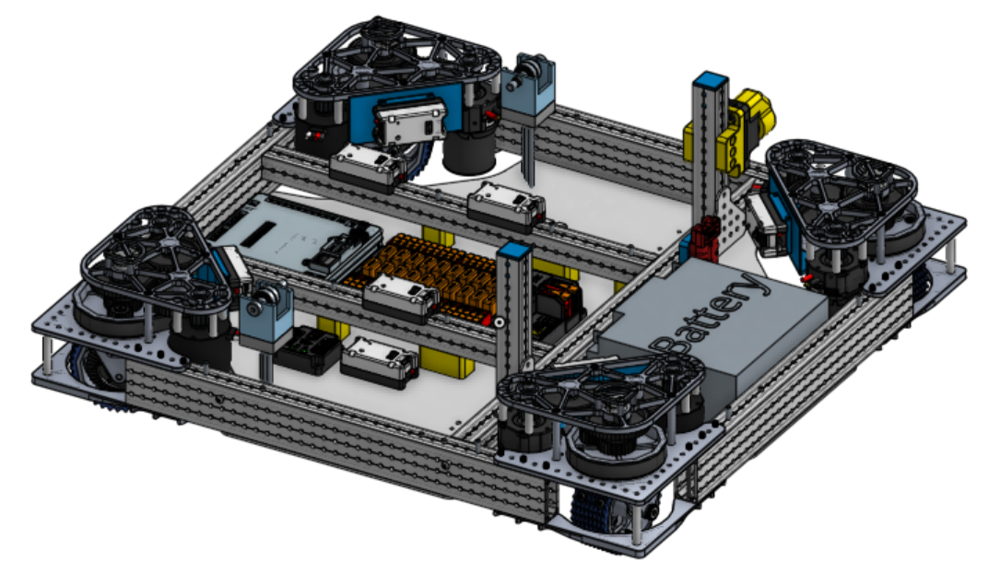

# Competetive Equipment Design Analysis
* Now that we have gone through the 2024 Crescendo FRC project together, we recognize the importance of using CAD to assist us in the design of future projects.
* We have decided to learn and use Onshape
* One of the benefits of choosing Onshape is that many other FRC teams also use it and have graciously shared their robot designs in the public space.
* This document is intended to *jumpstart* the process of examining some of the design practices that have been used by another, more experienced team in the design of their robot for the 2024 season.
* Feel free to poke around the public documents to learn more about how other experienced teams have designed their robots.

> This is the resarch phase of design.
When you get an idea, Google it and see if it already exists.
If so, adapt it to your needs.
If not, invent away!

## [FRC Team 587](https://www.team587.org/)'s Robot design
* The team used Onshape to design their robot and shared it in this [Onshape Public document](https://cad.onshape.com/documents/0ff54580033714c409ff00a0/w/1bc3f696902740f8553c42f3/e/a3d66caed13a1a11079879ef)

* There is a lot that we can learn by studying the organization of their CAD document. 
* **Robot Assembly** is comprised of several sub-assemblies in a heirarchical relationship.
    * Chassis Assembly
    * Arm Base Assembly (bolted to the chassis)
        * Elevator Assembly (Pivotally mounted to arm-Base)
            * Intake - Shooter Assembly (sliding mount to Elevator)
    * Climber Assembly (bolted to chassis)
    * Bumper Assembly (bolted to chassis)
____________________________________________________________

### Intake - Shooter Assembly

* This is comprised of a set of 6 rollers that hold the Note in preparation for shooting
* One small motor drives all 6 rollers
* Another small motor drives the big shooter rollers

____________________________________________________________

### Elevator Assembly

* The Elevator Assembly is pivotally mounted.
    * In its lower position, it accepts a Note from the fixed intake at the front of the robot
    * After a Note is loaded, it is pivoted up to a precise angle for shooting
____________________________________________________________

### Arm Base Assembly

* The Arm-Base Assembly integrates the entire Note handling system, including the rollers at the front of the robot that initially pick up the Note from the floor.
* It is completely modular, allowing all critical alignments to be self contained.
____________________________________________________________

### Chassis Assembly

* Note the chassis has a thin sheet metal belly plate
* Electrical components are not placed on a single big board, put are positioned in chosen locations
* Note the simple rectangular perimeter frame with internal cross-bars located to permit placement of the battery, RoboRIO, amd Power Distribution Panel.
* The Motor Controllers are mounted near the motors they are controlling.
 ____________________________________________________________

### Climber Assembly

 ____________________________________________________________

### Bumper Assembly

