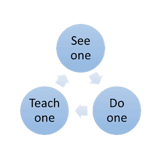
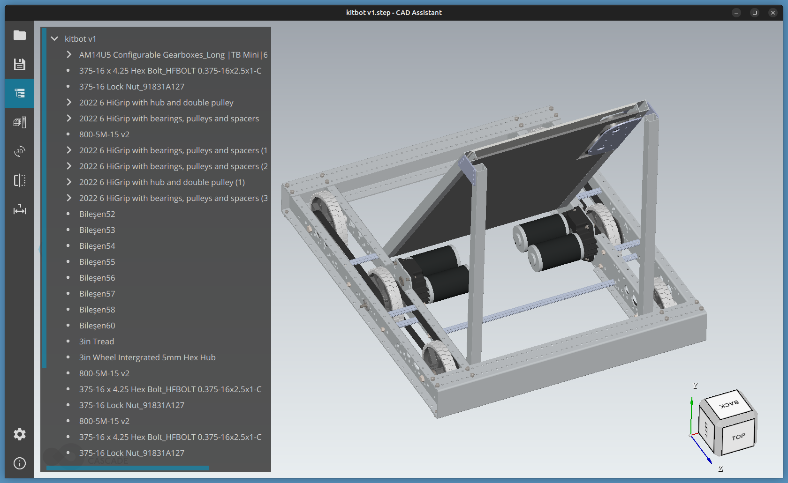
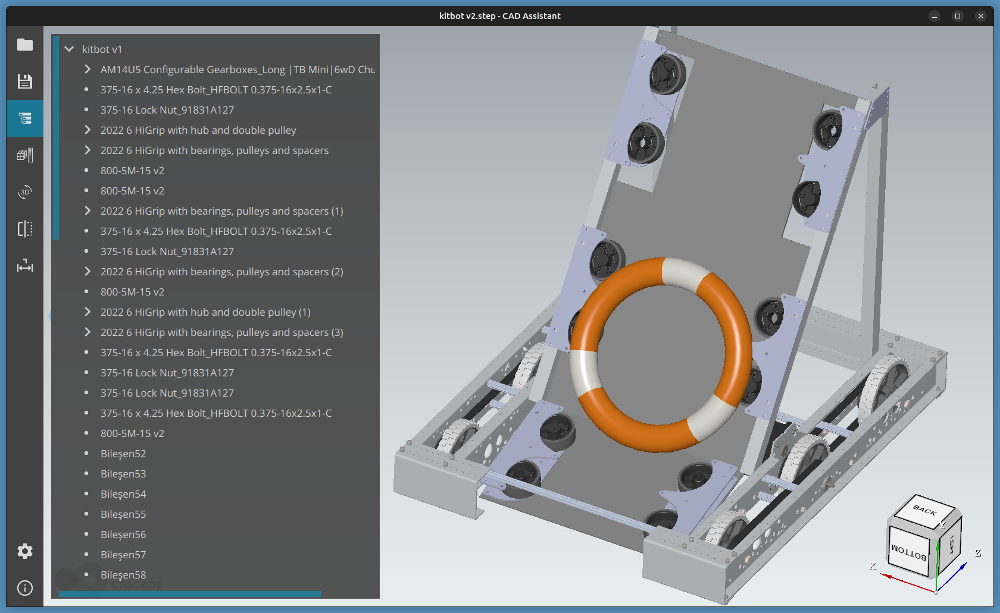
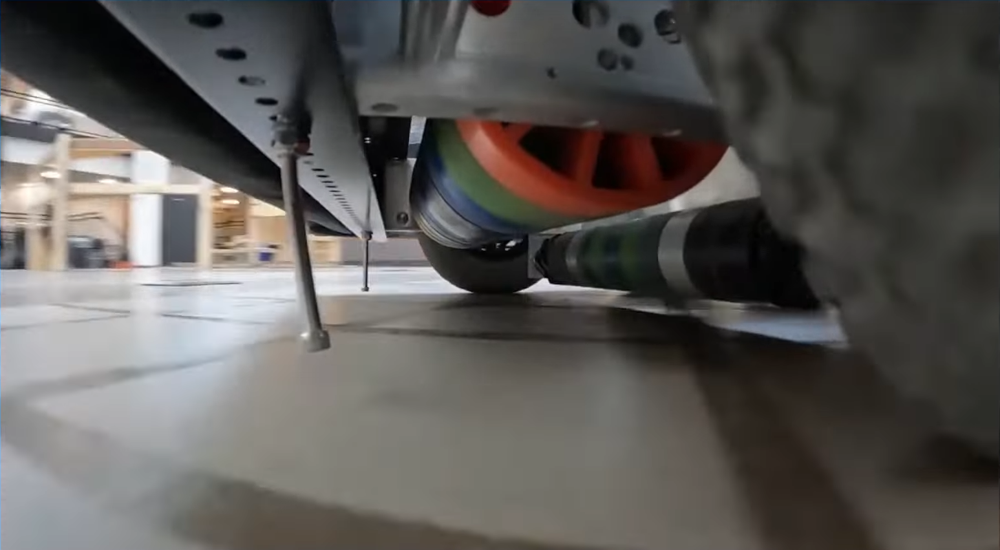

# Guiding the learning of skills needed to Design & Build Robots

* As a Mentor / Coach for our [FRC](https://www.firstinspires.org/robotics/frc) team, my goal is to help students learn the skills they need to design and build robots.
    * But learning is like a *rope*. You can't push it. It only works when it is pulled. **Ask questions if you get stuck or need  help.**
    * As a retired machine design professional, I am thrilled to have the opportunity to share my design experience with the students on our FRC team. But to get the maximum benefit, the students need to meet me half way. **Ask questions if there is something you don't understand.**

> A common *Misconception* is that Learning to use CAD is equivalent to becoming a good machine designer. This is like saying that learning to wield a paint brush makes you a good artist.

* But in truth, while learning to use CAD is an *important skill*, it is only the *first step* of learning to become a robot designer.

> In *Truth*, CAD has become the *lingua franca* of machine design. Learning to use it is a very important foundational skill that will facilitate learning more advanced skills in the Design process.

## Choosing which CAD to use?
* When I first joined our FRC team as a mentor (in the fall of '23), the kids were not using CAD. (One of them was struggling to come up the SolidWorks learning curve.) I thought they would have had an easier time if they had chosen to learn [DesignSpark Mechanical](https://www.rs-online.com/designspark/home) instead, for reasons I explain [here](https://github.com/dblanding/dsm).
* But I have now revised my opinion. I believe that [PTC Onshape](https://cad.onshape.com/) is the best CAD choice for students on FRC teams.
* Here are some of the reasons to prefer Onshape over DSM for our FRC team:
    * There is no installation required. It is cloud based and is accessed through a web browser.
    * Onshape is completely **free** for educational and non-commercial use. Creating an account is just a matter of registering with your email address.
    * There is an enormous amount of free online video tutorials available.
    * It is very quickly becoming the most popular CAD choice throughout the FRC community
    * It supports collabortion among team members by
        * Providing a Team space for shared documents
        * Providing collaboration tools allowing simultaneous access by mutiple users.
    * There is even an Onshape App that allows users to access their CAD documents from their phones.
* But on the downside:
    * Onshape documents are more complex than in other CAD systems. So there is more that must be learned in order to properly navigate and manage them.
    * But, IMHO, the benefit of bringing CAD instantly within reach of anyone with a web browser makes this an acceptable tradeoff.

--------------------------------------------
## This [Chief Delphi post](https://www.chiefdelphi.com/t/team-1114-simbotics-2024-simbot-skyfall-1-0-2-0-cad-release/475819) announces the public release of Team 1114 Simbot Skyfall FRC-2024 Robot.
* Links to 2 versions of their Onshape CAD model
* The Version 2 design is particularly elegant, showing a simplified configuration capable of completing all the 2024 FRC challenges:
    * Intake NOTES from the floor,
    * Delivery of NOTES to the AMP,
    * Shooting,
    * Hanging from the chain.
* The models have been made available without copy permission, but with export permission.
* It would be very educational for our team to explore and study their V2 CAD design, which I have exported and then re-imported into [MySimbot](https://cad.onshape.com/documents/0a68d33795905a6a1745ab0a/w/9181547f54e318f4ab4a0e38/e/a1e309b39d15b719c1a3881f?renderMode=0&uiState=6762a58966364b5d14c8c68d).

--------------------------------------------
## Competetive Design Analysis of [Team 587's FRC-2024 Robot](cda/design_analysis.md)
--------------------------------------------
## [How to Create a High-Level Project Plan](project_plan.md)
--------------------------------------------
## [OnShape Training](OnShape_Notes.md)
--------------------------------------------
### See One, Do One, Teach One
[SODOTO (See One, Do One, Teach One)](https://www.techtarget.com/whatis/definition/SODOTO) is a methodology of teaching and learning skills and best practices through:
1. See - Direct observation of a task
2. Do - Hands-on practical experience performing the task and
3. Teach - Teaching the task to another person.

--------------------------------------------
## 2024 FRC Design information found online

#### [Kitbot](https://www.firstinspires.org/resource-library/frc/kitbot)
* [Kitbot Assembly video (FIRST)](https://www.youtube.com/watch?v=ADcDsgZ8Jnc)
* 2024 kitbot STEP files available on grabcad

* [Floor Intake 2.0 Demo | Ri3D Cranberry Alarm | Crescendo 2024](https://www.youtube.com/watch?v=j8k97lN1e6U)
* [Top Crescendo Robot in 3 Days](https://www.youtube.com/watch?v=QpZLpU6u2BY)
    * Have a look at #3 UMN Robotics RI3D Under the frame intake. It looks like they have used some larger tires to get them a bit more clearance over the note. Also, their small intake roller looks to be contacting the note **above** the mid-line of the note. Still works like gangbusters.

#### FRC 2024 videos showing turret shooters
* [The Pink Team FRC 233 - 2024 Reveal Video](https://www.youtube.com/watch?v=9Ea0du3LMJg)
* [FRC 2024 Robot Shooter Turret Testing #FRC3255 - YouTube](https://www.youtube.com/shorts/y1pKOkQFz2k)
* [Ri3D 2024 | turret prototype for Robots Done Quick (RDQ)](https://www.youtube.com/shorts/90EWERjuAJA)
* [FRC 2024 Shooter Turret Test #FRC3255 - YouTube](https://www.youtube.com/shorts/wn7qfmoKAb4)
* [FRC 2024 Shooter Turret Motion #FRC3255 - YouTube](https://www.youtube.com/shorts/6OCutGedJpY)
* [FRC 2024 Turret tracking Test! #FRC3255 - YouTube](https://www.youtube.com/shorts/6MxR4o7DAZE)
* [FRC 2024 Robot Reveal - Team 3255 SuperNURDs](https://www.youtube.com/watch?v=5iuiX1t4GkY)
